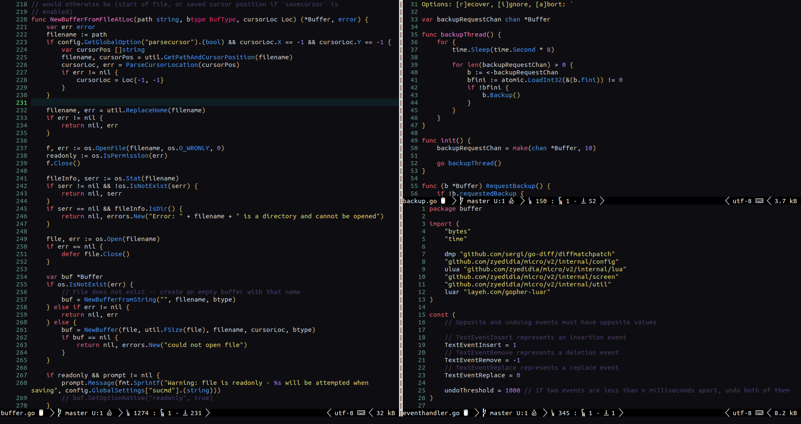
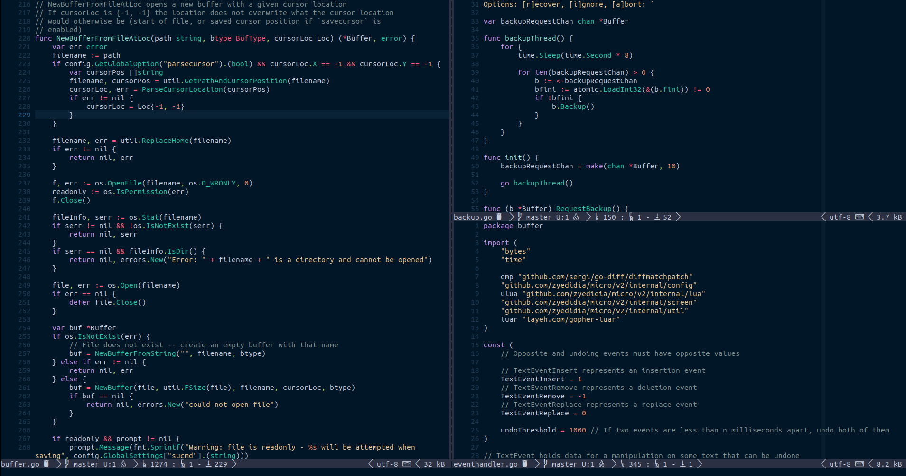

# Colorschemes - for [micro editor](https://micro-editor.github.io)

Colorschemes aggregator.

Feel free to add your colorschemes and share them with the community.

## Installation

### Settings

Add this repo as a **pluginrepos** option in the
**~/.config/micro/settings.json** file
(it is necessary to restart the micro after this change):

```json
  "pluginrepos": [
    "https://codeberg.org/micro-plugins/colorschemes/raw/branch/main/repo.json"
]
```

### Install

In your micro editor press **Ctrl-e** and run command:

```
> plugin install colorschemes
```

or run in your shell

```sh
micro -plugin install colorschemes
```

## Set

In your micro editor press **Ctrl-e** and run command:

```
> set colorscheme <scheme>
```

## Colorschemes

<details>
  <summary>bluemood-tc</summary>

  A port of Emacs Blue Mood theme.

  ```
  > set colorscheme bluemood-tc
  ```

  

  > Copyright (c) 2017 lmintmate
</details>

<details>
  <summary>cuddles</summary>

  Cuddles colorscheme.

  ```
  > set colorscheme cuddles
  ```

  

  > Copyright (c) 2021 github.com/jonathanhuston
</details>

<details>
  <summary>darken</summary>

  A dark colorscheme based on dark mode terminal for micro.

  ```
  > set colorscheme darken
  ```

  

  > Copyright (c) 2021 github.com/informeai
</details>

<details>
  <summary>donkey-paper</summary>

  Donkey is a finely tuned, 256 color, light-grey background colorscheme for Micro text editor.

  It is based on my [donbass.vim](https://github.com/vim-scripts/donbass.vim) colorscheme for Vim.

  ```
  > set colorscheme donkey-paper
  ```

  

  > Copyright (c) 2020 github.com/dmaluka
</details>

<details>
  <summary>gloom-tc</summary>

  A dark and gloomy pastel color syntax theme for Micro.

  Based on:

* [Gloom (atom)](https://github.com/hejrobin/gloom)
* [Rebeca (emacs)](https://github.com/vic/rebecca-theme)

```
  > set colorscheme gloom-tc
  ```

  

  > Copyright (c) 2022 taconi
</details>

<details>
  <summary>juju</summary>

  `one-dark` colorscheme slightly modified.

  ```
  > set colorscheme juju
  ```

  

  > Copyright (c) 2023 taconi
</details>

<details>
  <summary>nightfly-tc</summary>

  Port of the vim theme [nightfly](https://github.com/bluz71/vim-nightfly-guicolors).

  ```
  > set colorscheme nightfly-tc
  ```

  

  > Copyright (c) 2020 github.com/Mrfiregem
</details>

<details>
  <summary>owl</summary>

  A [Night Owl](https://github.com/sdras/night-owl-vscode-theme) color scheme port.

  Recommended to use with MICRO_TRUECOLOR=0.

  ```
  > set colorscheme owl
  ```

  

  > Copyright (c) 2021 Reinaldy Rafli

</details>

<details>
  <summary>spacecamp-tc</summary>

  Port of the vim theme [SpaceCamp](https://github.com/jaredgorski/SpaceCamp).

  ```
  > set colorscheme spacecamp-tc
  ```

  

  > Copyright (c) 2020 github.com/Mrfiregem
</details>
